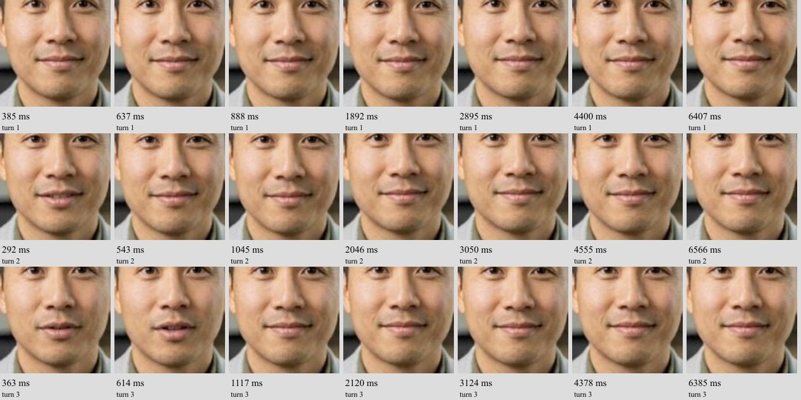

# Post-speech mouth movement and intermittent playback — October 1

## What was reproduced

The latest user scope is recorded in [CURRENT-GOAL.md](CURRENT-GOAL.md). This is a quality investigation, not a response-speed optimization.

An owned session on the existing instrumented preview produced three conversational responses. The browser captured timestamped screenshots after returned audio became quiet. In the second turn the mouth was slightly open at approximately 292 ms, then closed at the 543 ms sample. In the third turn it was slightly open at 363 and 614 ms, then closed at the 1117 ms sample. Selected later samples remained closed through approximately 6.5 seconds. This supports the report of brief residual motion/opening, but does not establish persistent motion throughout silence. The sample times do not establish an exact closure instant.

Audio quiet here means the preview analyser fell below RMS 0.001 following activity above 0.005, sampled every 20 ms. It is not a sample-exact recording of sound from the physical speakers. Screenshot timestamps bracket asynchronous capture; the contact metadata records capture completion as well. This was a synthetic spoken fixture and one connection, not the user's own microphone/network.

The same session reported one 288 ms video freeze, 1675 decoded frames and zero dropped decoded frames. The browser scheduler reported a maximum 14 ms timer delay, no long tasks, no hidden samples and no suspended audio samples. Both provider audio and returned audio had concealment increments; the provider had a concealment increment in the same approximately one-second interval as the video freeze. This is supporting evidence for intermittent playback disturbance, not proof that any one component caused it. Screenshots may perturb rendering even without a recorded long task.

## What the checks rule out—and what they do not

The demo's returned-speech observer updates the status label only; it does not animate or freeze the mouth. The returned video supplies the mouth pixels. A CPU-only staging check of the exact pinned runner confirmed that its empty-cache fallback can repeat its last video frame. It also identified a separate idle replay cache. That test used synthetic frame markers, so it does not establish which path executed at the observed mouth tail or whether model-generated silent frames retain speech motion.

Local runner versions do not match the pinned runtime source hash, so they are not being used as authoritative production logic. No matching session lines were found in this test's bounded main-worker log query; that query cannot support a GPU attribution. Root cause remains unproven. Next evidence must distinguish generated tail frames, idle replay/fallback, and audio/video presentation alignment; a patch should follow demonstrated cause, rather than hide the behavior by freezing the avatar or truncate audio.

## Safety and status

The owned session was deleted successfully (HTTP 200). The earlier CPU-only latency matrix had already finished; no new latency experiment was started. The idle-fallback staging test completed successfully without model calls or container network access. No runtime edit, deployment, model change, account migration or existing-key change was made.

The post-test read verified demo, dashboard and API health HTTP 200; all ten main workers ready on their original model, dispatcher and sidecar image digests; unchanged demo alias and dashboard snapshot. See [mouth-tail-health.json](mouth-tail-health.json), [mouth-tail-observation.json](mouth-tail-observation.json) and [idle-fallback-observation.json](idle-fallback-observation.json). Neither reported quality issue is claimed fixed.
