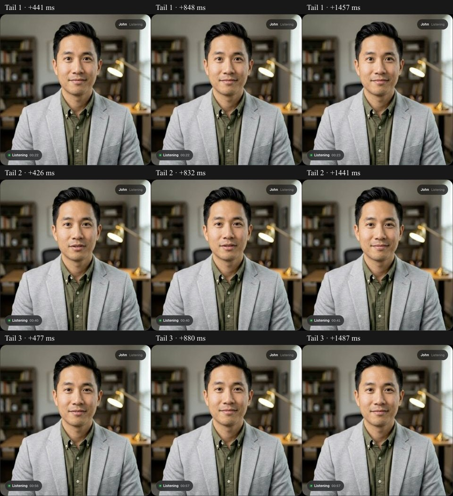
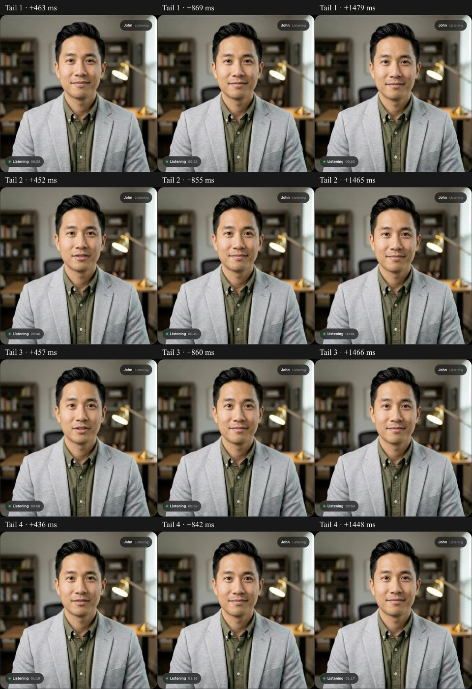

# Continuous-audio transport comparison

This completed, unpromoted comparison did not establish a fix. The experimental switch was removed from application source after testing. The public audio behavior remains unchanged. Protected preview commit `25d3476` used `NEXT_PUBLIC_TTS_CONTINUOUS_AUDIO=true` to set only `dtx: false` on the persistent TTS track published to Atlas. No sample gate, playback delay, resampling change, model/runner image, eye setting or mouth threshold is introduced. The comparison must preserve quiet speech and pass repeated visual tail checks before any promotion is considered.

The baseline negotiated answer contains `usedtx=1` for the outgoing synthesized track. Installed LiveKit client defaults enable DTX. A local browser loopback can verify codec negotiation and decode behavior but cannot stand in for the actual SFU/model/browser path. Production health and the ten-worker human image/configuration guard accompany the live preview check. Only owned synthetic test sessions are used and deleted.

The prior trace's provider stop event occurs 197–393 ms after observed source quiet in five tails. Residual low-level provider-decoded samples occur after that event. The [OpenAI server event reference](https://developers.openai.com/api/reference/resources/realtime/server-events#output_audio_buffer.stopped) identifies server-buffer drain, not client playout completion. It is therefore not safe to cut audio solely on this event. No such cut is implemented.

[Opus DTX](https://www.rfc-editor.org/rfc/rfc6716.html#section-2.1.9) reduces transmission during silence. [LiveKit's audio publishing options](https://docs.livekit.io/transport/media/advanced/) expose the setting. Neither source establishes DTX as this demo's cause; the experiment must do that.

## Results and visual review

The baseline captured three complete tails; the second remains visibly open at 426 and 832 ms, then closed at 1441 ms. The continuous-audio preview captured four complete tails. Its second and third tails are open at 452–457 ms, and all retained 842–869 ms samples are closed. These are separate generated responses and transport runs, not identical input. The timing difference does not establish a causal fix, and lingering movement still occurs without DTX. No promotion follows.

Negotiated codec receipts confirm `usedtx=1` on baseline outgoing audio and no DTX parameter on the continuous comparison. Both paths use UDP. The local four-trial browser loopback successfully decoded normal and quiet speech with either setting; both decoded the sustained clean zero tail below the existing visual gate. That local test does not reproduce a DTX tail cause. Discarded harness attempts are identified in loopback-summary.json and must not be interpreted as successful media tests.

The baseline collected 4678 numeric events and the comparison 6440. Numeric event logging may continue briefly while the snapshot is being saved, so console counts can differ by one; the saved analysis counts are authoritative. Synthetic source audio repeats and responses can differ. Screenshots and sampling have timing overhead. No actual model-input PCM was obtained in this comparison.

Both owned cloud sessions were deleted with HTTP 200; both browser processes exited. No staging GPU was created. The recorded public health check returns 200 for demo/dashboard/API and retains public deployment `dpl_4Gn3kBtiXyzeTusyp8y1b5imU3Ff`. The latest attempted production image recheck could not authenticate: Google Cloud requires reauthentication. The last successful ten-worker/controller audit was 09:39:07 UTC; do not present this later HTTP check as a fresh model inventory check.

## Next causal test

Capture only an owned synthetic session's decoded audio at the renderer input, then replay its speech-to-quiet boundary against the unchanged digest-pinned model. This will establish whether the observed faint browser tail survives decoding/resampling into the visual gate. Compare a clean-tail control without changing speech samples or timing. Do not install a generic RMS audio gate or stop media on the provider's server-drain event: either can truncate quiet or buffered speech. Cloud reauthentication is pending for the worker-side read and preservation audit.
