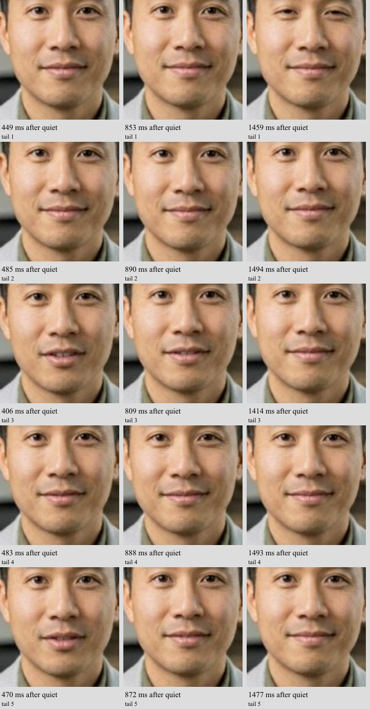

# Correlated mouth-tail and stutter trace

This protected preview adds read-only video frame callback metadata and 100 ms returned-audio peak-RMS windows. TypeScript and the Vercel preview build passed. Production was not promoted. The callback observes composition; it does not change media, buffering, audio timing, model parameters or frame contents.

The owned conversation produced 2773 video callbacks and five captured response tails (the microphone fixture repeated during the observation). Tail three still shows an open mouth at 406 and 809 ms after audio quiet, then closed at 1414 ms. Across its first 1.5 seconds, 35 video callbacks arrived and the presentation counter advanced by 35. Peak returned audio after the first 200 ms was 0.00011 RMS. Thus the lingering mouth shape appears in advancing returned video; it is not explained by an entirely frozen video element or the status label. This does not yet separate generated motion from upstream audio/video alignment.

Six display gaps exceeded 100 ms (100.1–166.6 ms). Corresponding last-packet arrival gaps were 131.1–236.7 ms. On those affected frames, decode/processing took 0.3–4.7 ms, with only 5.5–17.6 ms between arrival and expected display. Maximum observed scheduler delay was 5 ms. These gaps begin upstream of browser decoding rather than in a demonstrated long browser task. They do not distinguish server publication pacing, SFU behavior and network transport. Other frames had processing durations up to 47.8 ms; do not generalize the affected-frame result to all decoding.

The [frame-callback specification](https://wicg.github.io/video-rvfc/) defines receiveTime as the arrival time of the frame's last encoded packet and expectedDisplayTime as anticipated visibility. Correction from a full-trace review: captureTime was absent initially but present on 2647 of 2773 frames after synchronization. It is an estimated sender capture time, not a directly measured hardware clock. Callback delivery is best effort; screenshots may influence rendering. These timestamps do not provide a hardware speaker measurement or a measured server/client clock-skew bound.

The exact owned session matched main-security worker 9. Its bounded log trace contains 91 render-batch timing entries and 91 submissions. Sampled render queues near the six display gaps held 5–16 frames; adjacent batch wall times were 1277–1332 ms. These samples weaken a render-queue-empty explanation but cannot rule out an unsampled short underrun. Matching rows are in correlation.json; room/session identifiers and credential-bearing fields are excluded from shared logs.

The owned browser session was deleted successfully (HTTP 200). No runtime fix is claimed. The next isolated test feeds a real spoken fixture followed by zero audio into the exact model/runner images and captures paired output frames before LiveKit/browser presentation. Its plan preserves production digests, uses one staging-only L4 with a 30-minute stop bound, and requires deletion of the owned VM/boot disk after capture. Three large insertion attempts timed out without a VM or operation. A compact script referencing the existing speech-fixture image succeeded, using the same unique VM name and preserving the one-GPU ceiling. The owned VM is running its isolated setup; the model experiment is not yet complete.

Additional RTC counters: all six roughly two-second windows surrounding the video gaps had zero increase in reported packetsLost and decoded framesDropped. Two windows had Atlas audio concealment increments, and one had provider audio concealment. These counters therefore do not establish permanent packet loss or a single shared cause. Late packet arrival/recovery, publication cadence and media timing remain possible. See gap-rtc-windows.json. This is interval correlation, not a per-frame audio causality claim.

Validation: TypeScript and protected preview build passed; ESLint returned zero errors and one pre-existing useCallback dependency warning at app/demo.tsx. The follow-up health observation at 07:31:11 UTC found ten main workers ready with unchanged pins and demo/dashboard/API HTTP 200. Protected preview remains unpromoted.

Full-trace capture-time correction: the initial analysis incorrectly generalized missing captureTime from early frames. The corrected frame-analysis.json includes capture-time differences. At 9.647 s the source timestamp step was 40 ms, while capture-to-arrival rose from 6.0 to 97.1 ms. At 74.126 s it was 37 ms, while capture-to-arrival rose from 10.6 to 140.9 ms. These two stalls include substantial post-capture delivery delay, consistent with encoder/publication/transport jitter rather than delayed browser decoding. The other three later stalls also have 120–160 ms gaps between observed source timestamps; this cannot distinguish unpublished frames, encoder/SFU frame omission and delivery recovery without sender telemetry. Capture-time estimates have clock uncertainty (four negative capture-to-arrival samples), so absolute values are not ground truth; relative neighboring-frame changes are the stronger evidence. No blanket GPU or network root cause is claimed.

All ten main production workers have the same allowlisted mouth configuration as the isolated probe. The idle-mouth silence threshold is RMS 0.0001, whereas the browser observer declares quiet below 0.001. Low-level audio may therefore remain below the observer threshold while above the mouth gate threshold; this is a specific hypothesis, not proof. The configured close transition is eight frames with two-frame silence debounce and 0.85 lock strength. Actual installed behavior and raw paired frames must establish whether this accounts for the visible tail before changing any setting. See mouth-settings.json.

The gap at 74.126 s occurred during active returned speech and overlaps an approximately two-second RTC window containing 1891 concealed audio samples (about 39 ms at 48 kHz). The three later-source-gap events at 33.995, 87.26 and 98.891 s occurred during returned silence. The first two events predate the first detected speech activity. This distinction matters: six presentation gaps are not six speech cutoffs. See gap-audio-state.json.
