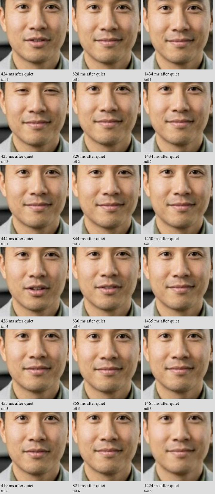

# Mouth gate and packet-recovery controls — October 1, 2026

Both reported symptoms are supported by captured evidence. This investigation has not changed production weights, images, settings, accounts or keys. The public demo remains on its existing deployment. General response-speed optimization remains out of scope.

## What the new evidence establishes

### The exact deployed mouth gate can stay open on very faint audio

A CPU-only staging build executed the actual `_framewise_mouth_lock_weights` helper extracted from the digest-pinned model mirror, without importing/running the model or using a GPU. Build `2d373196-e7e7-4397-9a41-ba177a0d65dd` succeeded. The installed animate-worker file hash is `42301cc805bbcaa2e5a8ef10439bc581741aeec30e0e2528fd56743b6b86f389`; the helper AST hash is recorded in gate-results.json.

After eight voiced frames, the test supplied 32 frames (1.28 seconds) at a controlled RMS, then zeros. At the production threshold of 0.0001, noise at 6 PCM16 units (0.000183 normalized RMS) prevents the close envelope from advancing for its entire duration. Full close weight is reached at 1.64 seconds after the tail begins. With zero or 2-unit noise, full close weight arrives at 0.36 seconds. A candidate threshold of 0.0003 restores 0.36-second closure for 6-unit noise, while 32/100-unit inputs still keep the gate open. These are envelope timings, not measured visual closure times.

This proves a mechanism capable of producing a long mouth tail. It does **not** yet prove that the browser symptom is caused by that mechanism: the actual model-input PCM for the affected conversational turn has not been captured. The previously observed returned-audio RMS is downstream of encoding/playback and is not the gate's input. A visual comparison and quiet-speech regression check remain necessary before selecting a fix.

The actual image calls its head-pose/translation smoothers without the mouth envelope. Do not treat the differently patched local root checkout as the deployed runtime. The two helper functions were exercised from the exact image; the whole local runtime was not substituted.

### Another owned browser call reproduced the mouth tail

The protected diagnostic preview produced 6192 numeric events, 2983 video callbacks, and six complete screenshot triplets. Tail 4 is visibly open at 426 ms and slightly open at 830 ms after returned audio quiet, then closed at 1435 ms. Its video advances by 36 presented frames in the first 1.5 seconds; returned-audio peak RMS after 200 ms is 0.00012. Other tails settle earlier. This again rules out treating the symptom as only a stale “Listening” label or a completely frozen video element.

Human-model appearance was visually checked in this call. Its response selected `atlas-current`, and the owned session's logs matched main-security worker 9. The latest ten-worker audit retains model digest `f853fbd1dc92ae7a514e93107e3696e8009f74e929180ac361e2e28e9d52e7e4`, runner digest `830547f2c1dbc0ce536db1df26c34a3b3a61bd57bb5e88aab26146c4b786c4ee`, and sidecar digest `b69fd39d00c132c6d96cbbc3fd4fdaa8a8bb3640c1260430c33db020b07bd991`. A name such as test4/test5 is not the deployment identity check.

### Packet loss and recovery explain part of the intermittent playback problem

Read-only instrumentation collected receiver statistics from both peer connections. During the largest observed video stall (3.283 seconds, during silence), the bracketing four-second window records:

- Atlas returned video: 40 additional reported lost packets, 111 NACK messages, 37 retransmitted packets received, and one picture-loss/keyframe request.
- Independent voice-provider connection: 20 additional lost packets and 12600 concealed samples.
- Matching GPU log samples: regular 32-frame render completions at 1288–1301 ms, with sampled render queues holding 5–8 frames.
- The eventual decoded frame takes 0.8 ms to process and appears about 26.5 ms after arrival.

This supports packet delivery/recovery as a cause of this stall. The simultaneous disruption on two separate connections suggests a shared path near this browser, but the failing hop is **not** identified. Do not conclude that all users are affected or that GPU inference took 3.3 seconds. Do not tune the model to compensate for these observations.

There are 31 callback gaps over 100 ms in this call; five occur while returned audio is classified active. The largest three gaps occur during silence. Across the call, the observed scheduler delay peaks at 25 ms with zero reported long tasks. Packet recovery counters were absent from the older diagnostic allowlist; they have now been added to preview-only logging. No receiver buffer, codec, pacing, or playback setting was changed.

## Limits

- Chromium did not expose `estimatedPlayoutTimestamp`, despite requesting it. The intended direct audio/video playout-clock comparison is therefore unavailable, not a successful synchronization check. The [WebRTC statistics specification](https://www.w3.org/TR/webrtc-stats/#dom-rtcinboundrtpstreamstats-estimatedplayouttimestamp) describes this optional measurement.
- Receiver counter windows bracket stalls; they do not map every lost packet to a particular frame. Source timestamps are browser estimates. Cross-machine clock skew is unmeasured.
- Screenshots and diagnostics may perturb the client. This is a synthetic call on one browser/network path, not a population latency benchmark.
- “Audio quiet” is the existing RMS observer with hysteresis, not sample-exact speaker silence. Six quiet transitions are not six independent controlled utterances.
- No customer speech, credentials or account records are included. Full screenshot originals (which contain synthetic captions) and raw owned-session logs stay private; their relevant numeric/cropped evidence and hashes are retained here.

## Staging and cleanup

Two new zone-a GPU creation attempts failed conclusively for capacity before startup; subsequent reads verified no VM or boot disk remained. A single one-L4 alternative in zone c is running the paired visual comparison on the same private staging subnet, with the same model/runner hashes, no external IP and no production connections. Its first boot was stopped before model launch to correct the model container CPU cap from 14 to 10 on the 12-vCPU host; the corrected boot has a shorter 20-minute cloud stop deadline. This is a harness correction, not a product defect or accepted inference result. The baseline and candidate differ only in the visual gate threshold. The paired result and final cleanup receipt must be attached before claiming that comparison passed.

The owned browser session was deleted successfully (HTTP 200). There were no page JavaScript errors. The CPU build completed successfully and owns no persistent GPU. Production health and image pins were rechecked; see production-health.json. Neither symptom is yet claimed fixed.

Validation: TypeScript (`tsc --noEmit`), ESLint on the changed preview diagnostic module, and `git diff --check` passed. The extra diagnostics have not been promoted to the public demo.
