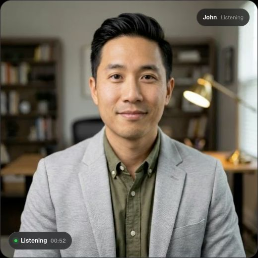

# Preserved human model — October 1, 2026

The public demo was visually checked in a fresh owned session. John rendered as the expected human face with natural eyes. The session returned `atlas-current` and its owned dispatcher log lines matched `avatar-pasteback-main-security-5`. The session was deleted successfully (HTTP 200); no page JavaScript errors were observed.

All ten main-security workers were ready. Their running and desired images remained pinned to the preserved digests, and their explicit eye, motion, head and mouth settings matched the prior verified configuration. The public demo deployment remained `dpl_4Gn3kBtiXyzeTusyp8y1b5imU3Ff`; demo, dashboard and API health all returned HTTP 200. No production configuration, deployment, model weight, customer account or key was changed by this check.

## Repeatable preservation check

Run `python3 scripts/check-human-model.py --output /private/tmp/human-model-audit.json` from this worktree before and after any approved demo/rendering change. It performs only `kubectl get` using the explicit main-security selector and cluster context. It exits unsuccessfully for a wrong digest, mutable image tag, missing/unready worker or visual-setting drift. It does not modify or restart anything. Do not replace the expected baseline to make an unexplained mismatch pass.

The baseline pins model `f853fbd1dc92ae7a514e93107e3696e8009f74e929180ac361e2e28e9d52e7e4`, runner `830547f2c1dbc0ce536db1df26c34a3b3a61bd57bb5e88aab26146c4b786c4ee`, and sidecar `b69fd39d00c132c6d96cbbc3fd4fdaa8a8bb3640c1260430c33db020b07bd991`. Mutable names such as test4/test5 are not sufficient identity evidence.

Pair a passing audit with a fresh owned demo session: confirm its actual pool assignment and visually inspect the face while speaking and idle, then delete the session. The script is a manual release check, not continuous monitoring or an automatic rollback service. It compares explicit pod settings; it cannot prove every future frame will look correct or detect an arbitrary runtime-only file modification.

Validation: the live audit passed; local fixtures confirmed rejection of a wrong model, changed eye target, missing worker, mutable tag and unready container. Numeric evidence and the cropped owned-session screenshot are retained here; credentials and raw session contents are excluded.

The mouth-tail candidate remains staging-only. Quiet-speech regression is running on a separate bounded GPU with the identical model/runner digests and unchanged eye settings. This preservation audit does not claim either mouth-tail or occasional packet-recovery stutter is fixed.
