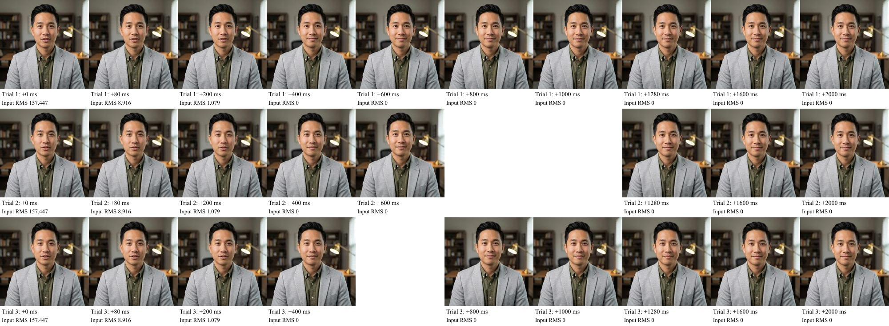

# Exact-model speech-to-silence capture

The isolated test uses the same model and runner digests and allowlisted mouth settings as all ten main production workers. It runs the same spoken fixture at three positions within the 32-frame context windows, followed by silence. The paired output audio is byte-for-byte equal to input in all three trials (224, 224 and 256 frames). Frames are captured before LiveKit publication, browser playback and UI state.

Visual result: the mouth is open/slightly open at the early 0–200 ms samples and closed at 400 ms in all three trials. Every retained later sample through 2 seconds remains closed, with ordinary head/eye variation. These particular clean-silence inputs do not reproduce the approximately 809 ms open-mouth browser sample. They do not prove the model closes equally quickly for every utterance or noisy input.

The probe produced ten selected frames per trial. The serial transport preserved 27 of 30 as complete decodable JSON/JPEG records; the three unretained samples are blank in the contact sheet (trial 2 at 800/1000 ms and trial 3 at 600 ms). Missing frames are not fabricated. Full images are sampled from 512-pixel frames and resized to 256 pixels for bounded export. Contact-sheet time zero is the last input frame above RMS 32 PCM16 units (approximately 0.001 normalized), not a physical microphone/speaker measurement. RMS numbers on the sheet are PCM16 units.

The prepared input-only control compares reproducible faint noise at 0, 6, 2 and 6 PCM16 units after the same speech, then zeros. Six units is below the browser observer's quiet threshold but above the existing mouth gate's 3.2768-unit threshold. It changes no model weights, image or configuration.

The harness failures and corrections are recorded in harness-attempts.json. This result is evidence, not a runtime fix or production acceptance. The input-only control did not execute: its first start and bounded retry both failed conclusively for staging GPU capacity. Cleanup verified both the owned VM and boot disk absent at 08:13:50 UTC. The 08:13:51 UTC production check found ten main workers ready on unchanged model/runner/sidecar hashes; demo, dashboard and API returned HTTP 200. See cleanup.json and production-health.json.
