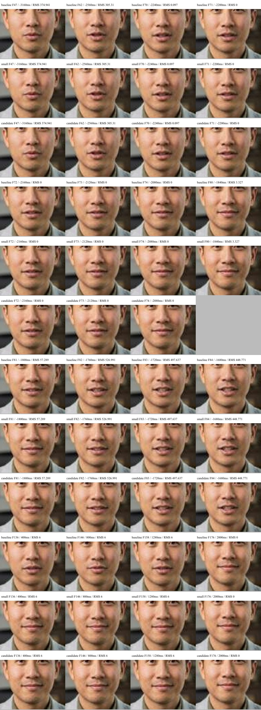
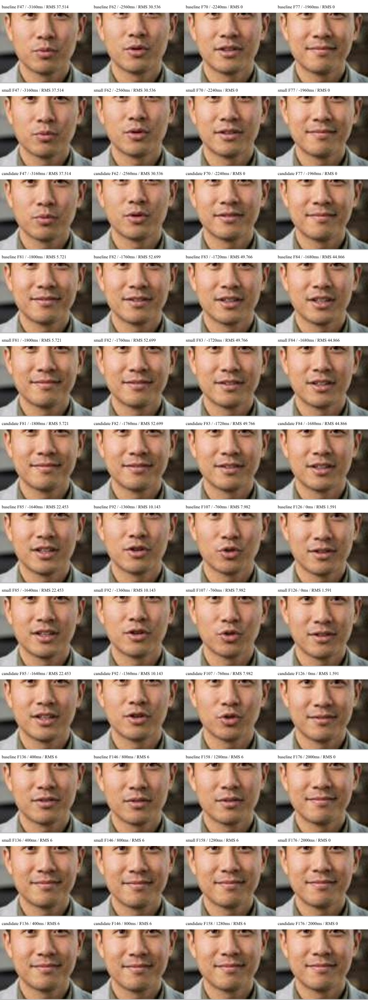

# Quiet-speech regression review — October 1, 2026

**Do not promote either threshold-only candidate.** Both improve the controlled faint-noise mouth tail, but their visual gate also suppresses/delays part of a quieter syllable opening. The regression gate has caught a tradeoff before production.

One isolated L4 ran the same preserved model and runner digests with thresholds 0.0001 (baseline), 0.0002 (small), and 0.0003 (candidate). Each condition received identical spoken fixtures at gains 1, 0.1, and 0.01, followed by 32 frames of 6-unit PCM16 noise and zeros. All nine trials completed; all 2304 paired output audio frames preserve the input bytes exactly. Audio, weights, eye settings, playback timing and batching were unchanged. The only rendering configuration difference was the visual silence threshold.

The browser/model preservation baseline remains model `f853fbd1dc92ae7a514e93107e3696e8009f74e929180ac361e2e28e9d52e7e4`, runner `830547f2c1dbc0ce536db1df26c34a3b3a61bd57bb5e88aab26146c4b786c4ee`. No production worker was restarted or changed.

## What the rendered frames show

Normal-gain sampled speech articulation remains broadly comparable. At the 6-unit noise tail, baseline samples stay open through 1280 ms, while both candidates are closed by the retained 400 ms sample. This repeats the previously established controlled-noise mechanism.

At gain 0.1, frame 81 has input RMS 57.289 PCM16 units: baseline is opening, while both candidates remain more closed. At gain 0.01, frame 82 has input RMS 52.699: baseline is visibly open while both candidates remain mostly closed, then open over subsequent frames. These samples are above normalized RMS 0.001. The gate carries its history into new speech; simply raising its quiet threshold is not an acceptable global correction.

There are 142 of 144 selected JPEGs retained with producer SHA-256 verification. Two candidate images were incomplete in serial transfer and remain blank in the comparison. Their exact positions are listed in review.json. Completion assertions establish probe execution and audio identity; they do not replace the missing visual evidence. Eye/blink phase differs between independently initialized conditions, so this is not a claim of pixel-identical faces outside the mouth.

## Follow-up constraints

An envelope-only follow-up, using the same two exact-image AST-hash-verified helpers, explores a one-frame reopening transition with threshold 0.0002. It removes additional closing weight on the sampled frames above RMS 0.001, but still changes lower-amplitude speech; at gain 0.001 a fixed threshold can suppress nearly all opening. This is an unrendered hypothesis, not an accepted fix or deployment plan. Do not trade quiet-speech correctness for a cleaner synthetic tail.

Next work must distinguish post-speech noise from genuine low-amplitude speech and preserve reopening. Keep the original human model and eye configuration unchanged, test representative conversational tails, and retain the existing audio and fast response timing. A candidate must pass both tail closure and speech articulation, including very low-level cases. The original production configuration remains in place.

The latest browser measurements and intermittent transport findings are in [upstream-tail](../upstream-tail/README.md). Appearance preservation is separately checked by the [human-model guard](../human-model-guard/README.md); the wide-eyed expression captured on the unchanged model remains a visual caveat, not evidence of an image swap.

Cleanup completed at 09:32:42 UTC: the owned staging VM and its boot disk were deleted and verified absent. Final production health passed at 09:32:46 UTC. The original ten GPU image pins and explicit visual settings remain unchanged; the controller replacement template also passes the preservation audit.
