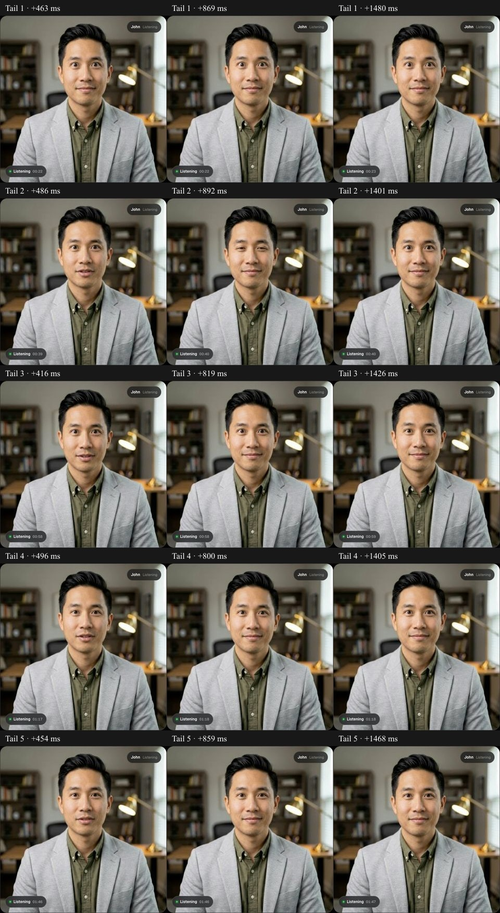

# Upstream quiet-tail observations — October 1, 2026

A protected preview of commit `2f3780b` added numeric envelope windows before and after the avatar, plus packet recovery and selected transport-type fields. It changed no audio, buffering, eye settings, model image or public alias. An owned synthetic conversation produced 7440 numeric events and five complete 400/800/1400 ms screenshot triplets. The session selected `atlas-current`, traced to main-security worker 7, and was deleted with HTTP 200. No page JavaScript errors were reported.

Four tails show an open mouth at roughly 416–496 ms after returned audio became quiet, then closed at 800–892 ms and later. The first tail is already closed at 463 ms. This supports the user's post-speech observation without treating every turn as equally affected.

There are brief low-level signals after the browser classifies source audio as quiet: within the 200–1500 ms source window, peak outgoing RMS ranges from 0.000145 to 0.000595 across these samples. Between four and twelve roughly 20 ms observations in each window exceed the production visual gate's 0.0001 threshold, while all are below the observer's 0.001 quiet threshold. These numeric observations support testing faint-tail sensitivity, but **are not the model-input PCM**. Browser resampling, Opus encoding/decoding and packet concealment occur after the outgoing measurement. They cannot establish that every visual tail has this cause.

Returned quiet windows also show low-level residual signals, up to RMS 0.000214 in tail 4. Correlation uses detected quiet transitions and may match an intra-response pause. The source-to-return quiet offset is not a response-time benchmark; no latency or batching change follows from this measurement.

## Appearance preservation

The longer capture contains a conspicuously wide-eyed idle expression in the first triplet; later triplets show narrower eyes and a blink. This cannot be dismissed merely because image hashes match. All ten preserved model/image/configuration checks still pass, and the owned session came from the verified main pool. There is no evidence of a model swap during this check, but this is also **not** a claim that every expression is visually acceptable. Retain these frames as an appearance check for further tests; do not alter eye controls as part of the mouth experiment.

## Intermittent playback

Six video callback intervals exceed 100 ms, with a maximum of 166.6 ms; all six occur while returned audio is classified quiet. Five have adjacent receiver-stat windows, and those windows show no additional reported packet loss, NACK or PLI and no dropped decoded frames. The first interval lacks a complete comparison window. Both provider and Atlas use UDP paths in this call; no TCP/relay explanation is supported here. This call does not reproduce the previous multi-second packet-recovery stall.

The owned worker records 91 render batches at 1225–1273 ms each (batch processing durations, not conversation response latency), brief 8–9 ms audio-queue waits and one incoming-silence drop at capacity. There is no evidence here of dropped spoken audio. The observations do not justify changing the model or slowing normal playback to mask occasional delivery jitter.

## Limits and next gate

This is one synthetic browser/network path. Diagnostic sampling and screenshots can perturb timing. Browser RMS windows are approximate and not sample-exact at the GPU. Numeric logs exclude credentials, account data, transcripts and audio samples. Original screenshots with synthetic captions remain private; cropped comparison and original hashes are retained.

The [quiet-speech GPU comparison](../quiet-speech/README.md) completed nine trials against unchanged digest-pinned images. Both threshold-only candidates showed a quieter-syllable regression and were not promoted. Neither a universal root cause nor a production fix is claimed from this call alone.
